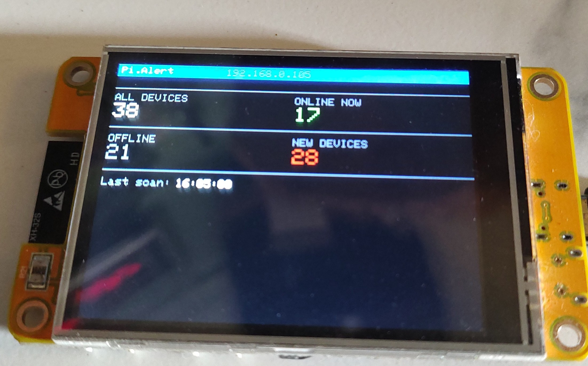
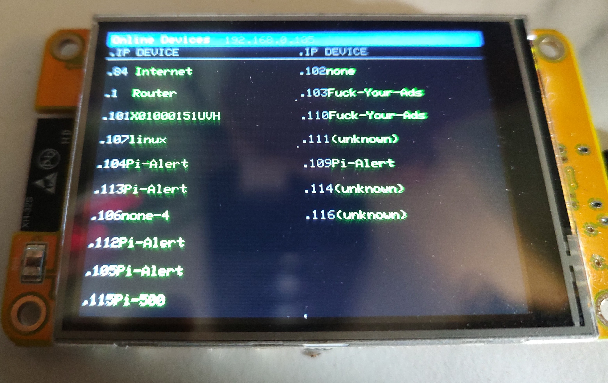
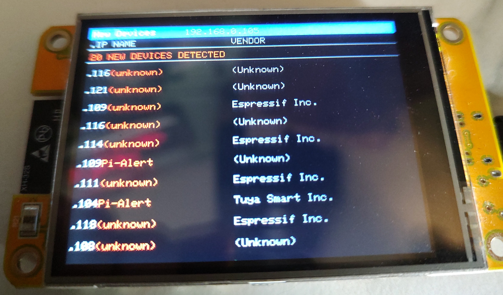
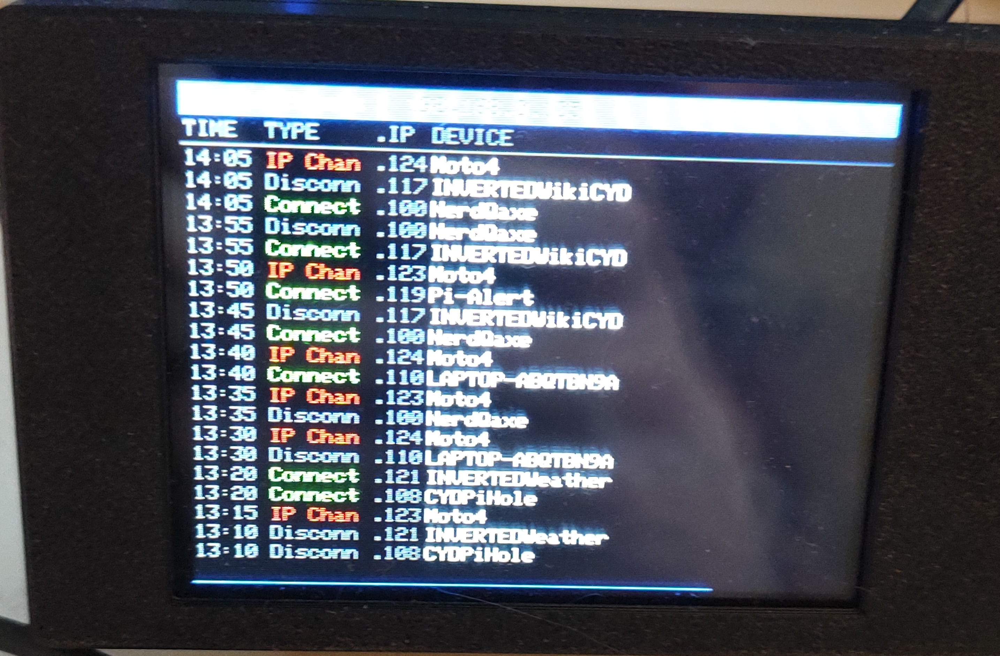
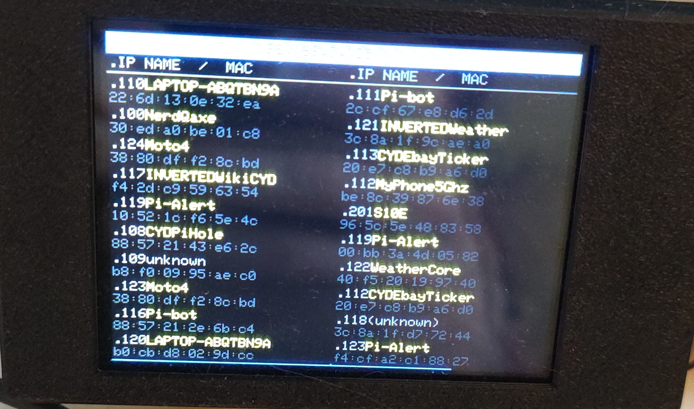
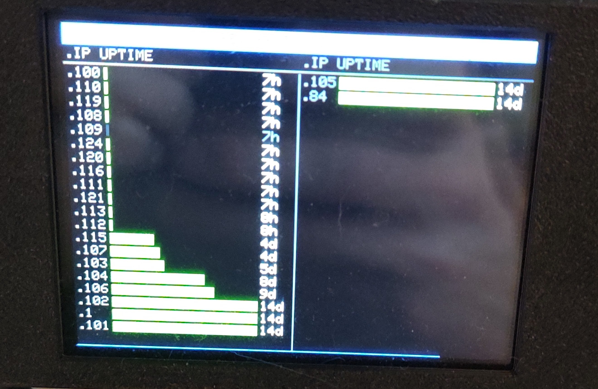
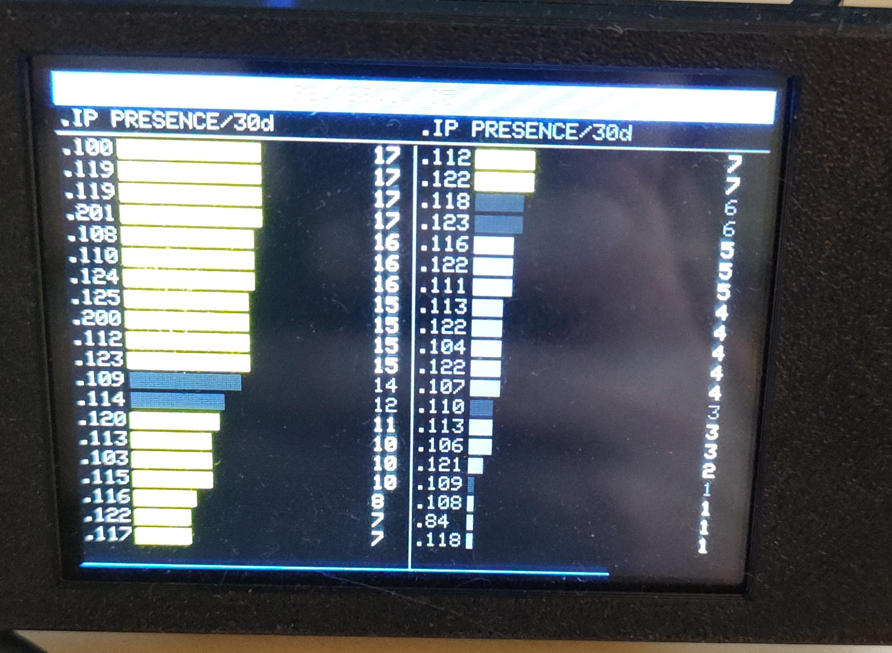
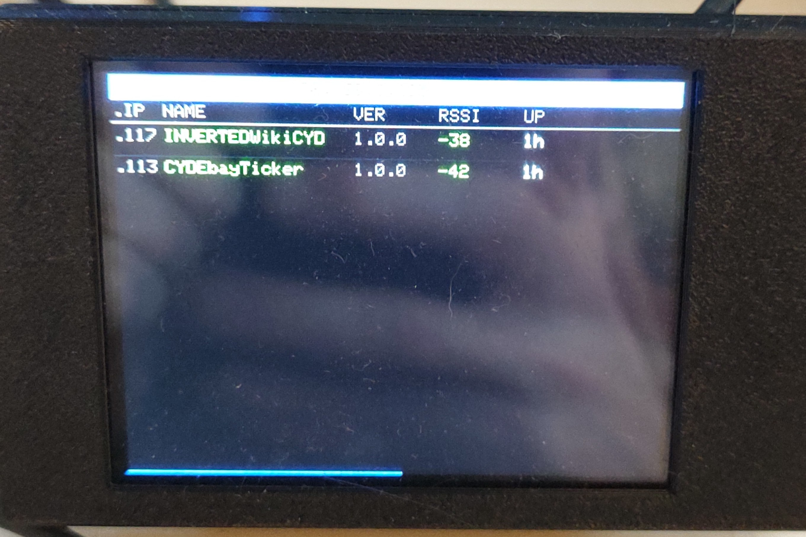
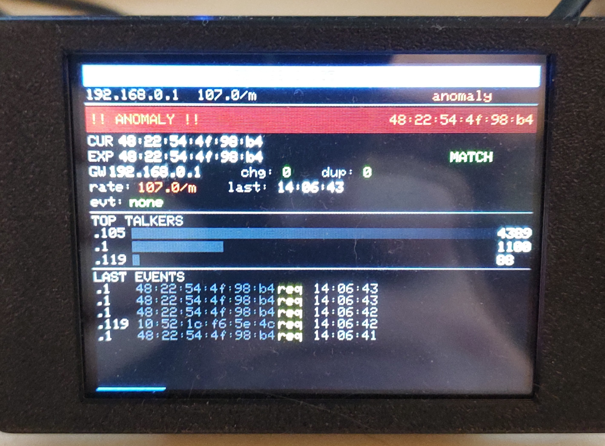

# CYDPiAlert

A **Pi.Alert network presence monitor** running on the **CYD (Cheap Yellow Display)** ESP32 board.  
Fetches live network data from your local [Pi.Alert](https://github.com/pucherot/Pi.Alert) instance and displays it on the built-in 320×240 TFT. **Touch the screen** left or right to cycle through 12 display modes.


*Mode 0: Dashboard — total devices, online/offline counts, new device alert count, last scan time*

---

## What It Shows

| Mode | Name | Description |
|------|------|-------------|
| **0** | **Dashboard** | Total devices, online now, offline, new devices count, last scan time |
| **1** | **Online Devices** | All currently online devices — last IP octet + name, 2-column layout |
| **2** | **Offline Devices** | All currently offline devices — same 2-column layout |
| **3** | **New Devices** | Unknown/unacknowledged devices — IP, name, vendor (red alert banner if any) |
| **4** | **Down Devices** | Monitored devices currently offline and flagged "Alert when down" — shown in red |
| **5** | **Recent Events** | Live feed of the last 20 connect/disconnect/IP-change events |
| **6** | **IP History** | Last 20 distinct MAC→IP pairs — name (yellow) + full MAC (grey) |
| **7** | **Uptime Bars** | Proportional uptime bars for all online devices, shortest first — scaled to 2 weeks max |
| **8** | **Presence Bars** | Days each device was seen in the last 30 days — green ≥20d, yellow 7–19d, grey <7d |
| **9** | **ESP Devices** | All CYD ESP32 devices on your network that respond to `/identify` — IP, name, version, RSSI, uptime |
| **10** | **ARP Watch** | ARP anomalies detected by `arpwatch_daemon.py` — GATEWAY_MAC / ARP_SPOOF / MAC_CHANGE |
| **11** | **ARP Status** | Full ARP health dashboard — gateway MAC match, rate, top talkers, last events |
| **12** | **WiFi AP Scan** | Live list of all visible access points — SSID, channel, RSSI bar, security (Open/WEP/WPA/WPA2/WPA3). Sorted by signal strength. Updates every 30 seconds. Works without monitor mode. |
| **13** | **Shady Networks** | Suspicious network analyzer — scores each visible AP for evil-twin attacks, open networks, hidden SSIDs, suspiciously strong signals, and malicious SSID patterns. Color-coded threat/warning/clean status. |
| **14** | **BLE Devices** | Bluetooth LE device scanner — lists all nearby BLE devices with MAC, name, and RSSI bar. Flags devices matching known card-skimmer OUI prefixes or suspicious device names. |

---

## Screenshots


*Mode 1: Online Devices — 2-column layout, last IP octet + device name*


*Mode 3: New Devices — red alert banner, IP + name + vendor for each unacknowledged device*


*Mode 5: Recent Events — time, event type (Connect/Disconn/IP Chan), IP, device name*


*Mode 6: IP History — device name (yellow) on top, full MAC address below, 2-column layout*


*Mode 7: Uptime Bars — proportional green bar per device, time label (Xm/Xh/Xd), 2 columns of 20*


*Mode 8: Presence Bars — days seen in last 30 days, green/yellow/grey by frequency*


*Mode 9: ESP Devices — probes all known IPs for /identify, shows name, firmware version, RSSI, uptime*


*Mode 11: ARP Status — gateway MAC CUR/EXP match, rate, change/dupe counts, top talkers, last events*

---

## Navigation

| Action | Result |
|--------|--------|
| **Touch right half of screen** | Next mode → |
| **Touch left half of screen** | ← Previous mode |
| **Short press BOOT button** | Next mode → |
| **Hold BOOT button ~1.5 seconds** | Open **Mode Manager** (toggle modes on/off) |
| **Hold BOOT button 3 seconds** | Restart into WiFi/server setup |

A **blue countdown bar** at the very bottom of the screen drains left-to-right over 30 seconds, showing time until the next automatic refresh.

---

## Mode Manager (Toggle Modes On/Off)

Hold the **BOOT button for ~1.5 seconds** (release before 3s) to open the Mode Manager. This lets you **disable any modes you don't want** — for example, if you haven't patched the Pi.Alert server yet you can turn off the modes that require it, or if you don't run `arpwatch_daemon.py` you can hide the ARP modes.

```
MODE MANAGER                    hold BOOT to exit
[ON ] Pi.Alert
[ON ] Online Devices
[ON ] Offline Devices
[OFF] New Devices
[OFF] Down Devices
...
< prev  center:toggle  next >
```

| Action in Mode Manager | Result |
|------------------------|--------|
| **Touch left third** | Move selection up |
| **Touch right third** | Move selection down |
| **Touch center** | Toggle selected mode ON/OFF |
| **Short press BOOT** | Toggle selected mode ON/OFF |
| **Hold BOOT ~1.5 seconds** | Save settings and exit |

- Disabled modes are **completely skipped** when cycling left/right with touch or the BOOT button.
- You **cannot disable the last remaining enabled mode** (at least one is always kept on).
- Settings are **saved to flash (NVS)** and survive reboots. All modes default to ON on first flash.

---

## Hardware

| Function | GPIO |
|----------|------|
| TFT DC | 2 |
| TFT CS | 15 |
| TFT SCK | 14 |
| TFT MOSI | 13 |
| TFT MISO | 12 |
| Backlight | 21 |
| BOOT button | 0 |
| Touch IRQ | 36 |
| Touch MOSI | 32 |
| Touch MISO | 39 |
| Touch CLK | 25 |
| Touch CS | 33 |

> ⚠️ The ESP32 only supports **2.4 GHz** WiFi networks.

---

## Error Handling

When a fetch fails (network hiccup, Pi.Alert busy):
- If the mode has **previously loaded data**, the last good data stays on screen and only the header bar turns red with the error message. Data is never wiped on a transient failure.
- If there is **no prior data** (e.g. first boot), the error is shown in the data area as usual.
- The HTTP request is retried up to **3 times** with increasing delays (800 ms, then 1600 ms) before giving up.

---

## Requirements

### Pi.Alert Server

- **Pi.Alert** installed and running (tested with the original [Pi.Alert by pucherot](https://github.com/pucherot/Pi.Alert))
- **API key** configured in Pi.Alert → **Maintenance** → **API Key**
- Pi.Alert accessible on your local network via HTTP

### Which Modes Require Server Modifications

Most modes require custom API endpoints added to Pi.Alert's `index.php`. Modes 10 and 11 additionally require the companion `arpwatch_daemon.py` script running on the Pi.

| Mode | Endpoint | Requires modification? |
|------|----------|------------------------|
| 0 — Dashboard | `system-status` | No — built-in |
| 1 — Online | `all-online` | No — built-in |
| 2 — Offline | `all-offline` | No — built-in |
| 3 — New Devices | `all-new` | **Yes — patch index.php** |
| 4 — Down Devices | `all-down` | **Yes — patch index.php** |
| 5 — Recent Events | `recent-events` | **Yes — patch index.php** |
| 6 — IP History | `ip-changes` | **Yes — patch index.php** |
| 7 — Uptime Bars | `online-uptime` | **Yes — patch index.php** |
| 8 — Presence Bars | `device-presence` | **Yes — patch index.php** |
| 9 — ESP Devices | `all-device-ips` | **Yes — patch index.php** |
| 10 — ARP Watch | `arp-alerts` | **Yes — patch index.php + arpwatch_daemon.py** |
| 11 — ARP Status | `arp-status` | **Yes — patch index.php + arpwatch_daemon.py** |
| 12 — WiFi AP Scan | *(file-based)* | **Yes — patch index.php + wifi_scan_daemon.py** |
| 13 — Shady Networks | *(file-based)* | **Yes — patch index.php + wifi_scan_daemon.py** |
| 14 — BLE Devices | *(file-based)* | **Yes — patch index.php + ble_scan_daemon.py** |

> 💡 If you only want basic network monitoring, Modes 0–2 work with a stock Pi.Alert install. Use the [Mode Manager](#mode-manager-toggle-modes-onoff) to disable everything else.

---

## Pi.Alert Server Modifications

> ⚠️ This is a one-time change to a single PHP file on your Pi.Alert server. It adds new read-only API endpoints and does not affect any existing Pi.Alert functionality.

The complete patched `index.php` is included in this repo at [`pialert-patch/index.php`](pialert-patch/index.php). You can either copy it directly or apply the changes manually.

### Option A — Copy the patched file directly (easiest)

SSH into your Pi.Alert server, then:

```bash
# Back up the original
sudo cp /opt/pialert/front/api/index.php /opt/pialert/front/api/index.php.bak

# Copy the patched version from this repo (adjust path as needed)
sudo cp pialert-patch/index.php /opt/pialert/front/api/index.php
sudo chown www-data:www-data /opt/pialert/front/api/index.php
```

> ⚠️ The patched file is based on a stock Pi.Alert install from the official repo. If your version has local customisations, use **Option B** to add just the new endpoints manually.

---

### Option B — Apply changes manually

#### Step 1 — SSH into your Pi.Alert server and open the file

```bash
ssh your-username@your-pi-alert-ip
sudo nano /opt/pialert/front/api/index.php
```

#### Step 2 — Add new cases to the switch block

Find the switch block (around line 50). It will end with something like:

```php
    case 'all-new':getAllNew();
        break;
    }
```

Add the following cases **before** the closing `}`:

```php
    case 'all-down':getAllDown();
        break;
    case 'recent-events':getRecentEvents();
        break;
    case 'ip-changes':getIPChanges();
        break;
    case 'online-uptime':getOnlineUptime();
        break;
    case 'device-presence':getDevicePresence();
        break;
    case 'all-device-ips':getAllDeviceIPs();
        break;
    case 'arp-alerts':getArpAlerts();
        break;
    case 'arp-status':getArpStatus();
        break;
    }
```

#### Step 3 — Add the new functions

Find the closing `?>` at the bottom of the file and paste these functions **before** it. The full implementations are in [`pialert-patch/index.php`](pialert-patch/index.php) — copy from there to ensure you have the current versions.

#### Step 4 — Verify the endpoints work

```bash
APIKEY="your-api-key-here"
HOST="your-pi-alert-ip"

curl -s -X POST -F "api-key=$APIKEY" -F "get=all-down"        http://$HOST/pialert/api/
curl -s -X POST -F "api-key=$APIKEY" -F "get=recent-events"   http://$HOST/pialert/api/
curl -s -X POST -F "api-key=$APIKEY" -F "get=ip-changes"      http://$HOST/pialert/api/
curl -s -X POST -F "api-key=$APIKEY" -F "get=online-uptime"   http://$HOST/pialert/api/
curl -s -X POST -F "api-key=$APIKEY" -F "get=device-presence" http://$HOST/pialert/api/
curl -s -X POST -F "api-key=$APIKEY" -F "get=all-device-ips"  http://$HOST/pialert/api/
```

Each should return a JSON array. `[]` means no data in that category — that's correct.

---

### ARP Watch (Modes 10 & 11) — Additional Setup

Modes 10 and 11 require `arpwatch_daemon.py` running on the Pi.Alert host. This is a companion Python daemon that passively monitors ARP traffic, detects anomalies (gateway MAC changes, ARP spoofing, duplicate IPs), and exposes a JSON status endpoint on port 8765 that Pi.Alert's patched `index.php` reads.

The daemon and setup instructions are maintained separately. Without it running, Modes 10 and 11 will show "No ARP data" — use the [Mode Manager](#mode-manager-toggle-modes-onoff) to disable them if you don't need ARP monitoring.

---

### WiFi AP Scan + Shady Networks (Modes 12 & 13) — Additional Setup

Modes 12 and 13 are powered by `wifi_scan_daemon.py`. It runs `iw dev wlan0 scan` every 30 seconds — **no monitor mode required** — to build a live list of visible access points and score each one for suspicious characteristics (evil twins, open networks, random SSIDs, etc.).

```bash
# Copy daemon to Pi
sudo cp pialert-patch/wifi_scan_daemon.py /home/pi/wifi_scan_daemon.py

# Install as systemd service
sudo tee /etc/systemd/system/wifi-scan.service > /dev/null << 'EOF'
[Unit]
Description=CYDPiAlert WiFi AP Scan Daemon
After=network.target

[Service]
Type=simple
ExecStart=/usr/bin/python3 /home/pi/wifi_scan_daemon.py
Restart=always
RestartSec=10
User=root

[Install]
WantedBy=multi-user.target
EOF

sudo systemctl daemon-reload
sudo systemctl enable wifi-scan.service
sudo systemctl start wifi-scan.service
```

#### Shady scoring explained

| Flag | Description | Score |
|------|-------------|-------|
| `evil_twin` | Same SSID seen from 2+ different BSSIDs | +40 |
| `open` | No encryption | +20 |
| `hidden_ssid` | SSID field is empty/hidden | +10 |
| `strong_signal` | RSSI > −30 dBm (suspiciously close) | +15 |
| `suspicious_ssid` | Contains known bait-SSID keywords | +25 |
| `random_ssid` | All-hex SSID (looks auto-generated) | +15 |
| `suspicious_oui` | OUI matches known cheap hacking hardware | +30 |

Networks with a total score ≥ 15 appear in **Mode 13 — Shady Networks**. Scores ≥ 60 trigger a "THREAT" banner; 30–59 show "WARNING".

---

### BLE Scanner (Mode 14) — Additional Setup

Mode 16 is powered by `ble_scan_daemon.py`. It uses `bluetoothctl` to scan for nearby Bluetooth LE devices every 45 seconds. The Pi 3B has a built-in BCM43438 Bluetooth radio — no extra hardware needed.

```bash
# Copy daemon to Pi
sudo cp pialert-patch/ble_scan_daemon.py /home/pi/ble_scan_daemon.py

# Install as systemd service
sudo tee /etc/systemd/system/ble-scan.service > /dev/null << 'EOF'
[Unit]
Description=CYDPiAlert BLE Scanner Daemon
After=bluetooth.target

[Service]
Type=simple
ExecStart=/usr/bin/python3 /home/pi/ble_scan_daemon.py
Restart=always
RestartSec=15
User=root

[Install]
WantedBy=multi-user.target
EOF

sudo systemctl daemon-reload
sudo systemctl enable ble-scan.service
sudo systemctl start ble-scan.service
```

Devices are flagged as suspicious if their MAC OUI matches known cheap BLE module prefixes commonly used in card skimmers, or if their advertised name matches known skimmer name patterns (`HC-05`, `HC-06`, `linvor`, etc.). Flagged devices are highlighted in red.

---

## First-Time Setup (ESP32)

1. Flash the firmware using PlatformIO (`pio run --target upload`)
2. On first boot, the ESP32 broadcasts a setup access point:
   ```
   SSID: CYDPiAlert_Setup   (no password)
   ```
3. Connect your phone or PC to `CYDPiAlert_Setup`
4. Open a browser and navigate to `192.168.4.1`
5. Fill in the form:
   - **WiFi Network Name** — your home 2.4 GHz network SSID
   - **WiFi Password** — leave blank for open networks
   - **Pi.Alert IP / Hostname** — bare IP only, e.g. `192.168.0.105` (no `http://`, no `/pialert/`)
   - **Pi.Alert API Key** — found in Pi.Alert → Maintenance → API Key
6. Tap **Save & Connect**

Settings are stored in flash (NVS) and survive reboots. To re-enter setup, hold **BOOT for 3 seconds** at any time.

---

## Building with PlatformIO

### Dependencies (auto-installed)

- `moononournation/GFX Library for Arduino @ 1.4.7`
- `bblanchon/ArduinoJson @ ^7`
- `PaulStoffregen/XPT2046_Touchscreen` (via GitHub)

### Build & Upload

```bash
cd /path/to/CYDPiAlert
pio run --target upload
```

### Serial Monitor

```bash
pio device monitor --baud 115200
```

---

## Project Structure

```
CYDPiAlert/
├── platformio.ini              # PlatformIO config (board, libs)
├── pialert-patch/
│   ├── index.php               # Patched Pi.Alert API file (drop-in replacement)
│   ├── wifi_monitor_daemon.py  # 802.11 RF monitor daemon (optional, requires monitor mode)
│   ├── wifi_scan_daemon.py     # WiFi AP scanner + shady scorer (modes 12 & 13)
│   └── ble_scan_daemon.py      # BLE device scanner + skimmer detector (mode 14)
├── include/
│   ├── Portal.h                # Captive portal: WiFi + Pi.Alert credentials, NVS
│   ├── PiAlert.h               # HTTP fetch functions + data structs for modes 0–9
│   ├── ArpWatch.h              # Fetch functions for Mode 10 (ARP Watch)
│   ├── ArpStatus.h             # Fetch functions for Mode 11 (ARP Status)
│   ├── WifiMonitor.h           # Fetch functions for Modes 12 & 13 (WiFi monitor)
│   ├── WifiScan.h              # Fetch functions for Modes 12 & 13 (WiFi AP scan)
│   ├── BleScan.h               # Fetch functions for Mode 14 (BLE devices)
│   └── CYDIdentity.h           # /identify HTTP endpoint (device self-identification)
└── src/
    └── main.cpp                # Display init, all draw functions, touch + button, Mode Manager
```

---

## Troubleshooting

| Error on screen | Cause | Fix |
|----------------|-------|-----|
| `ERR: Wrong API key` | API key doesn't match Pi.Alert | Re-enter setup; copy key from Pi.Alert → Maintenance → API Key |
| `Fetch failed: HTTP 404` | Wrong Pi.Alert host or path | Enter bare IP only, e.g. `192.168.0.105` |
| `Fetch failed: JSON error` | Missing API endpoint | Patch Pi.Alert's `index.php` (see above) |
| `Fetch failed: No connection` | WiFi dropped | Retries automatically on next 30s cycle |
| `WiFi failed: "YourSSID"` | Wrong SSID or password | Hold BOOT 3s to re-enter setup |
| Screen stays on "Refreshing..." | Pi.Alert scan still running | Wait — Pi.Alert scans run every 3–5 minutes |
| Mode 10/11 shows "No ARP data" | `arpwatch_daemon.py` not running | Start the daemon, or disable modes 10/11 via Mode Manager |
| Mode 12/13 shows "Fetch failed: Daemon not running" | `wifi_monitor_daemon.py` not running | `sudo systemctl start wifi-monitor.service` |
| Mode 12 stuck on "LEARNING" | Daemon crashed and restarted during learn window | Wait 60s; if looping check `journalctl -u wifi-monitor.service` |
| Mode 12/13 shows "Fetch failed: Daemon not running" | `wifi_scan_daemon.py` not running | `sudo systemctl start wifi-scan.service` |
| Mode 14 shows "Fetch failed: Daemon not running" | `ble_scan_daemon.py` not running | `sudo systemctl start ble-scan.service` |

---

## Notes

- Refresh interval is **30 seconds**. Pi.Alert's ARP scan runs every 3–5 minutes so dashboard counts only change that often.
- **Mode 3 — New Devices** shows devices Pi.Alert detected but you haven't acknowledged yet. Clear them in Pi.Alert → Devices.
- **Mode 4 — Down Devices** only shows devices that have `Alert when down` enabled in Pi.Alert device settings. Devices not flagged will appear in Mode 2 (Offline) instead.
- **Mode 5 — Recent Events** includes all event types: `Connected`, `Disconnected`, `IP Change`, `VOIDED`, etc. `VOIDED` events are normal — Pi.Alert uses them to correct scan anomalies.
- **Mode 6 — IP History** shows the 20 most recently seen MAC→IP pairs, ordered newest first. Yellow = named device, grey = unknown. Useful for correlating ESP32s, phones, or other devices that change IPs to their MAC addresses.
- **Mode 7 — Uptime Bars** shows how long each currently-online device has been continuously present. Scale caps at 2 weeks — any device online longer fills the bar completely.
- **Mode 8 — Presence Bars** shows device regularity over 30 days. Green = very regular (20+ days), yellow = occasional (7–19 days), grey = rarely seen (<7 days).
- **Mode 9 — ESP Devices** probes every known IP on your network for a `/identify` HTTP endpoint. Any CYD-based project (CYDPiHole, CYDEbayTicker, etc.) that implements the endpoint will appear here with name, firmware version, RSSI, and uptime.
- **Mode 12 — WiFi Status** shows a color-coded status banner (green=ok, yellow=warning, red=anomaly). During the first 60 seconds after daemon start it shows a "LEARNING" countdown — this is normal; all visible APs are being whitelisted. The mode auto-refreshes from the daemon's JSON every 30 seconds.
- **Mode 13 — WiFi Detail** shows the channel activity bar chart (channels 1–13), rogue AP list with BSSID/channel/RSSI/SSID, last deauth event, and top BSSIDs by frame count. Without monitor mode, deauths and probe rates stay at 0 but AP detection still works on channel 1.
- **Mode 12 — WiFi AP Scan** lists all visible networks sorted by signal strength with RSSI bars and security badges. Open networks are shown in red. Updates every 30 seconds — **works without monitor mode**.
- **Mode 13 — Shady Networks** analyzes each visible AP for threat indicators. A score ≥ 15 makes it "shady" (open networks score 20 by themselves). Scores ≥ 60 trigger a red THREAT banner; 30–59 show "WARNING".
- **Mode 14 — BLE Devices** scans every ~45 seconds. Most home environments will show phones, smart speakers, and fitness trackers. Red `!!` prefix = suspicious OUI or name. An empty list just means no BLE devices are broadcasting nearby.
- Compatible with the original [Pi.Alert by pucherot](https://github.com/pucherot/Pi.Alert). Forks (Pi.Alert CE, IPAM) may have different API paths or database schemas.

---

## Related Project

**[CYDPiHole](../CYDPiHole)** — Displays live Pi-hole v6 DNS query data on the same CYD hardware with 5 modes: live query feed, stats summary, top blocked domains, top clients, and 24h activity graph.

